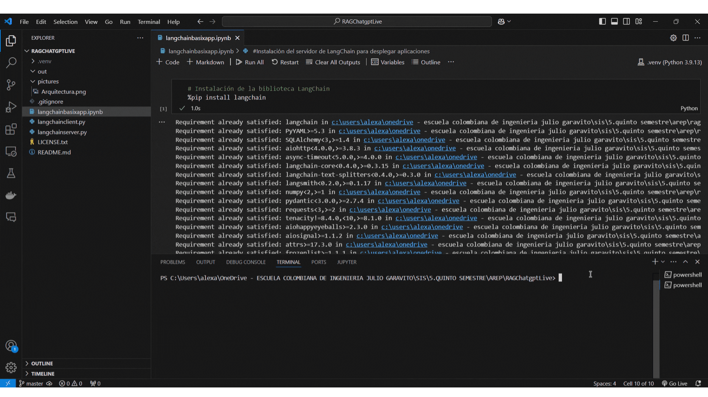

# LangChain Basix App Project

This project implements an application based on LangChain to demonstrate basic language model interaction functionalities. The steps described in [LangChain Tutorials](https://python.langchain.com/docs/tutorials/llm_chain/) were followed.


The project provides an environment to explore the use of LangChain, allowing the creation of prompt templates, processing chains with memory, and handling of custom messages. Detailed examples of client and server files are included to manage requests and responses from language models.

## Getting Started

These instructions will get you a copy of the project up and running on your local machine and on AWS for development and testing purposes.

## Prerequisites

Make sure to have the following tools installed to run this project:

1. **Python (version 3.8 or higher)**
   - Download it from [python.org](https://www.python.org/downloads/).

   ```sh
   python --version
   ```
   It should display something like:

   ```sh
   Python 3.9.7
   ```

2. **Git**
   - Download it from [git-scm.com](https://git-scm.com/downloads).

   ```sh
   git --version
   ```
   It should display something like:

   ```sh
   git version 2.31.1
   ```

## Installation and Local Setup

### Clone the repository

Clone the repository to your local machine:

```bash
    git clone https://github.com/alexandrac1420/LLM_PrimeraParte.git
    cd LLM_PrimeraParte
```

### API Key Configuration in Jupyter Notebook

In Jupyter Notebook, set up the environment variable for the OpenAI API key by creating a new Python environment:
1. Go to **New Kernel** > **Python Environment** > **Create Python Environment**.
2. Make sure to select the `venv` option.
3. If any additional package is required when running the first command, install it to ensure all commands run correctly.

## Local Usage of LangChain Basix App

### Features

The project includes:

1. **Prompt Templates**: Allows parameterization of requests sent to the model.
2. **Processing Chains (LLM Chains)**: Integrates prompts and models to process requests in a chained manner.
3. **Conversation Memory**: Stores interaction history.
4. **Custom Message Handling**: Uses `HumanMessage` and `SystemMessage` types.

### Running Examples

To run the service, follow these steps:

1. **Execute all commands in the Jupyter Notebook** following the tutorial and ensure the OpenAI API key is set to a valid one.

2. **Start the server** from a terminal by running:

   ```bash
   python langchainserver.py
   ```

   You should see an output similar to:

   ```
   LANGSERVE: Playground for chain "/chain/" is live at:
   LANGSERVE:  │
   LANGSERVE:  └──> /chain/playground/
   LANGSERVE:
   LANGSERVE: See all available routes at /docs/
   INFO:     Application startup complete.
   INFO:     Uvicorn running on http://localhost:8000 (Press CTRL+C to quit)
   ```

3. **Access the interactive page** at [http://localhost:8000/chain/playground/](http://localhost:8000/chain/playground/). This page allows you to define a language and a phrase to be translated into that language.

4. **Run the client** in another terminal to send a static message to the server and receive the translation to Italian:

   ```bash
   python langchainclient.py
   ```

## Architecture

### Architecture Diagram

The architecture of this project follows a client-server model where:

1. **The user** interacts with the **client** (Python script or web interface).
2. **The client** sends requests to the **server**.
3. **The server** (implemented in `langchainserver.py`) receives and processes the requests using the LangChain library.
4. **The server** communicates with the **OpenAI GPT language model** to get a response.
5. **The server** updates the **conversation memory** with the interaction history.
6. **The server** sends the response back to the **client**.
7. **The client** displays the response to the **user**.


## Built With

- [LangChain](https://langchain.com/) - Library for developing LLM applications.
- [Jupyter Notebook](https://jupyter.org/) - Interactive development environment.
- [OpenAI](https://openai.com/) - Language model provider.

## Versioning

I use [GitHub](https://github.com/) for versioning. For the versions available, see the [tags on this repository](https://github.com/alexandrac1420/LLM_PrimeraParte.git).

## Authors

- **Alexandra Cortes** - [alexandrac1420](https://github.com/alexandrac1420)

## License

This project is licensed under GNU.

